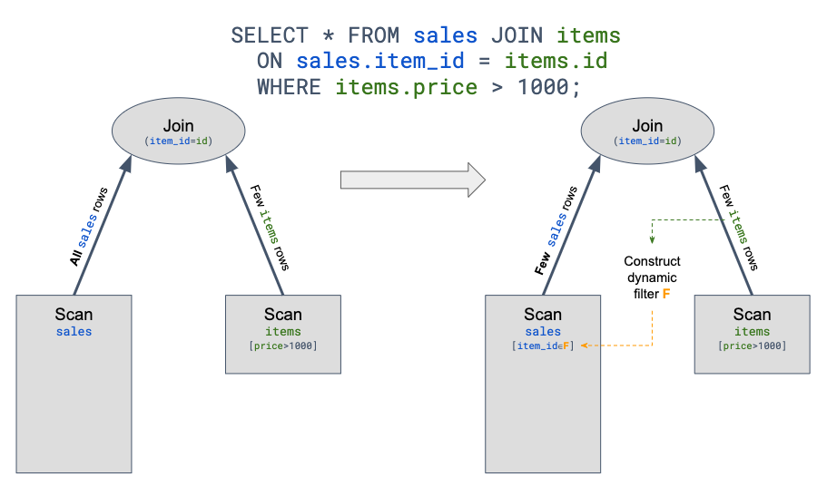

# Introduction

The imperative of the so-called Dynamic Partitioning Pruning (dpp) feature it to optimize a common pattern of SQL query which 1) joins two tables; and 2) includes a highy selective predicate.

Consider the following query:

)

The left-hand side illustrates a direct (un-optimized) execution which will proceed to fetch all rows from the large `sales` fact table.

The right-hand side illustrates dpp's optimization which generates and injects an implicit filter into the fact table.

## TPC-DS 


SF | Table | Rows |
|:-|:-|:-|
1 | item | est. 18,000 |
1 | store_sales | 2,879,789 | 
10 | item | est. 102,000 |
10 | store_sales | 28,800,501 |
100 | item | ? |
100 | store_sales | est. 280M
1000 | item | ? |
1000 | store_sales | 2,879,987,999 |


|Table| 
|:-|
call_center| 
catalog_page|
catalog_returns| 
catalog_sales|
customer|
customer_address|
customer_demographics|
date_dim|
household_demographics|
income_band|
inventory|
item|
promotion|
reason|
ship_mode|
store|
store_returns|
store_sales| 
time_dim|
warehouse|
web_page|
web_returns|
web_sales|
web_site|


## Table schemas

### `store_sales`
|Column| Type| Extra|
|:-|:-|:-|
 ss_sold_date_sk       | integer      |       |         
 ss_sold_time_sk       | integer      |       |         
 ss_item_sk            | integer      |       |         
 ss_customer_sk        | integer      |       |         
 ss_cdemo_sk           | integer      |       |         
 ss_hdemo_sk           | integer      |       |         
 ss_addr_sk            | integer      |       |         
 ss_store_sk           | integer      |       |         
 ss_promo_sk           | integer      |       |         
 ss_ticket_number      | bigint       |       |         
 ss_quantity           | integer      |       |         
 ss_wholesale_cost     | decimal(7,2) |       |         
 ss_list_price         | decimal(7,2) |       |         
 ss_sales_price        | decimal(7,2) |       |         
 ss_ext_discount_amt   | decimal(7,2) |       |         
 ss_ext_sales_price    | decimal(7,2) |       |         
 ss_ext_wholesale_cost | decimal(7,2) |       |         
 ss_ext_list_price     | decimal(7,2) |       |         
 ss_ext_tax            | decimal(7,2) |       |         
 ss_coupon_amt         | decimal(7,2) |       |         
 ss_net_paid           | decimal(7,2) |       |         
 ss_net_paid_inc_tax   | decimal(7,2) |       |         
 ss_net_profit         | decimal(7,2) |       |         

### `item`
|Column      |  Type   | COUNT DISTINCT |  Representative |
|:-|:-|:-|:-|
 i_item_sk        | bigint  |       |         
 i_item_id        | varchar |       |         
 i_rec_start_date | varchar |       |         
 i_rec_end_date   | varchar |       |         
 i_item_desc      | varchar |       |         
 i_current_price  | double  |       |         
 i_wholesale_cost | double  |       |         
 i_brand_id       | integer |       |         
 i_brand          | varchar |    712   |   'univbrand #7' |      
 i_class_id       | integer |       |         
 i_class          | varchar |       |         
 i_category_id    | integer |       |         
 i_category       | varchar |  10     |   'Electronics' |      
 i_manufact_id    | integer |       |         
 i_manufact       | varchar |       |         
 i_size           | varchar |    7   |   'small'  |      
 i_formulation    | varchar |       |         
 i_color          | varchar |    92   |  'chocolate' |       
 i_units          | varchar |       |         
 i_container      | varchar |       |         
 i_manager_id     | integer |       |         
 i_product_name   | varchar |       |         

### `date_dim`
|Column      |  Type   |  Representative |
|:-|:-|:-|
 d_date_sk           | bigint  |    2451000   |         
 d_date_id           | varchar |    'AAAAAAAAIDGGFCAA'   |         
 d_date              | varchar |       |         
 d_month_seq         | integer |       |         
 d_week_seq          | integer |       |         
 d_quarter_seq       | integer |       |         
 d_year              | integer |    1998   |         
 d_dow               | integer |     0  |         
 d_moy               | integer |    7   |         
 d_dom               | integer |    5   |         
 d_qoy               | integer |    3   |         
 d_fy_year           | integer |     1998  |         
 d_fy_quarter_seq    | integer |       |         
 d_fy_week_seq       | integer |       |         
 d_day_name          | varchar |       |         
 d_quarter_name      | varchar |       |         
 d_holiday           | varchar |       |         
 d_weekend           | varchar |       |         
 d_following_holiday | varchar |       |         
 d_first_dom         | integer |       |         
 d_last_dom          | integer |       |         
 d_same_day_ly       | integer |       |         
 d_same_day_lq       | integer |       |         
 d_current_day       | varchar |       |         
 d_current_week      | varchar |       |         
 d_current_month     | varchar |       |         
 d_current_quarter   | varchar |       |         
 d_current_year      | varchar |       |   

## Notable Queries

### Connectivity test:

Working; scale factor 1;
```SQL
SELECT * FROM deltas3."$path$"."s3://tpc-datasets/tpcds-2.13/tpcds_sf1_delta/store_sales" LIMIT 10;
```

Working; scale factor 10;
```SQL
SELECT * FROM deltas3."$path$"."s3://tpc-datasets/tpcds-2.13/tpcds_sf10_delta/store_sales" LIMIT 10;
```

Scale factor 100: Not working; corrupted?
```SQL
trino> SELECT * FROM deltas3."$path$"."s3://tpc-datasets/tpcds-2.13/tpcds_sf100_delta/store_sales" LIMIT 10;
Query 20220119_201846_00003_wmkca failed: Error reading tail from s3://tpc-datasets/tpcds-2.13/tpcds_sf100_delta/store_sales/ss_sold_date_sk=2451478/part-01303-dd1529ec-66c4-406b-90df-1b26d563ba70.c000.snappy.parquet with length 16384
```

```SQL
SELECT count(*) FROM deltas3."$path$"."s3://tpc-datasets/tpcds_1000_dat_delta/store_sales";
```

### Prototype
(Non-matching (scale-factor) datasets used in some queries... this is (more likely) invalid and (worse case) erroneous.)

#### THE QUERY

Baseline

All queries are written against TPC-DS at scale factor (SF) 1000. (Note the `1000` in the URL `s3://tpc-datasets/tpcds_1000_dat_delta`.) Comparable data (and hence queries) are available at SF 1 and 10 via the alternate paths `s3://tpc-datasets/tpcds-2.13/tpcds_sf1_delta` and `s3://tpc-datasets/tpcds-2.13/tpcds_sf10_delta`. 


Consider: 
```SQL
# QUERY1 ("altquery")
WITH
  store_sales AS (SELECT * FROM deltas3."$path$"."s3://tpc-datasets/tpcds_1000_dat_delta/store_sales" ),
  date_dim AS (SELECT * FROM deltas3."$path$"."s3://tpc-datasets/tpcds_1000_dat_delta/date_dim" )

SELECT * FROM store_sales

JOIN date_dim ON ss_sold_date_sk = d_date_sk 

WHERE d_date_sk = 2451000
;
```

`QUERY1` showcases the need for dynamic partition pruning: there is a join between a large `stores_sales` ("fact table") with a smaller `date_dim` ("dimension"). `store_sales` is partitioned on `sold_date`. The predicate `d_date_sk = 2451000` is trivially applied by Presto on `date_dim` but it needs to be (indirectly) applied to `store_sales` so as to reduce the needless scanning of the entire fact table. 

This query runs across all three fork/config:

PX | Query | Planning Time | Execution Time|
|:-|:-|:-|:-|
Trino (partition pruning ON (default)) | QUERY1 | 26.10s | 46.83s 
Trino (partition pruning OFF) | QUERY1 | 26.97s | 2.79m
PrestoDB | QUERY1 | 14.55s | 1.31m 


Additional predicates layered on `QUERY1` pose no difficulty. (Note the additional `JOIN` of `item` below.)

```SQL
# QUERY2 ("altquery2")
WITH
  store_sales AS (SELECT * FROM deltas3."$path$"."s3://tpc-datasets/tpcds_1000_dat_delta/store_sales" ),
  item AS (SELECT * FROM deltas3."$path$"."s3://tpc-datasets/tpcds_1000_dat_delta/item" ),
  date_dim AS (SELECT * FROM deltas3."$path$"."s3://tpc-datasets/tpcds_1000_dat_delta/date_dim" )

SELECT * FROM store_sales

JOIN date_dim ON ss_sold_date_sk = d_date_sk 
JOIN item ON ss_item_sk = i_item_sk

WHERE d_date_sk = 2451000
 AND i_color = 'chocolate' AND i_size = 'small'
;
```
PX | Query | Planning Time | Execution Time|
|:-|:-|:-|:-|
Trino (partition pruning ON (default)) | QUERY2 | 39.18s | 44.72s
Trino (partition pruning OFF) | QUERY2 | 39.42s | 2.85m 
PrestoDB | QUERY2 | 21.17s | 28.74s |


Variation `QUERY4` illustrates the current limitation. `QUERY4` is similar to `QUERY1` with one difference: `QUERY1`'s predicate `d_year=1998 AND d_moy=7 AND d_dom=5` is replaced with `d_date_sk = 2451000`. The two predicates are chosen to be equivalent:

```bash
trino> WITH 
    ->   date_dim AS (SELECT * FROM deltas3."$path$"."s3://tpc-datasets/tpcds_1000_dat_delta/date_dim" )
    -> SELECT d_date_sk from date_dim WHERE d_year=1998 AND d_moy=7 AND d_dom=5;
 d_date_sk 
-----------
   2451000 
(1 row)
```

```SQL
# QUERY4 ("altquery4")
WITH
  store_sales AS (SELECT * FROM deltas3."$path$"."s3://tpc-datasets/tpcds_1000_dat_delta/store_sales" ),
  date_dim AS (SELECT * FROM deltas3."$path$"."s3://tpc-datasets/tpcds_1000_dat_delta/date_dim" )

SELECT * FROM store_sales

JOIN date_dim ON ss_sold_date_sk = d_date_sk 

WHERE d_year=1998 AND d_moy=7 AND d_dom=5
;
```

But here, no dynamic partition pruning was observed (even when running with the feature defaulted to ON):

PX | Query | Planning Time | Execution Time|
|:-|:-|:-|:-|
Trino (partition pruning ON (default)) | QUERY4 | 26.25s | est 3h
Trino (partition pruning OFF) | QUERY4 | 26.06s | long
PrestoDB | QUERY4 | 14.00s | long | 

As the run-time was too long, I trialed two variations:
1. Lower SF (10 instead of 1000)
2. Larger cluster (10 nodes instead of the 1 node)


```SQL
# QUERY4-1 ("altquery4-sf1")
WITH
  store_sales_sf1 AS (SELECT * FROM deltas3."$path$"."s3://tpc-datasets/tpcds-2.13/tpcds_sf1_delta/store_sales" ),
  date_dim AS (SELECT * FROM deltas3."$path$"."s3://tpc-datasets/tpcds_1000_dat_delta/date_dim" )

SELECT * FROM store_sales_sf1 store_sales

JOIN date_dim ON ss_sold_date_sk = d_date_sk 

WHERE d_year=1998 AND d_moy=7 AND d_dom=5
;
```

```SQL
# QUERY4-10 ("altquery4-sf10")
WITH
  store_sales_sf10 AS (SELECT * FROM deltas3."$path$"."s3://tpc-datasets/tpcds-2.13/tpcds_sf10_delta/store_sales" ),
  date_dim AS (SELECT * FROM deltas3."$path$"."s3://tpc-datasets/tpcds_1000_dat_delta/date_dim" )

SELECT * FROM store_sales_sf10 store_sales

JOIN date_dim ON ss_sold_date_sk = d_date_sk 

WHERE d_year=1998 AND d_moy=7 AND d_dom=5
;
```

Version|PX | Query | nodes | SF | Planning Time | Execution Time| 
:-|:-|:-|:-|:-|:-|:-|
[359g](https://github.com/overcoil/trino/tree/vkorukanti-339-delta) | Trino (partition pruning ON (default)) | QUERY4 | 1 | 1000 | 26.25s | est 3h
[359g](https://github.com/overcoil/trino/tree/vkorukanti-339-delta) | Trino (partition pruning ON (default)) | QUERY4-1 | 1 | 1 | 16.37s | 1.87m
[359g](https://github.com/overcoil/trino/tree/vkorukanti-339-delta) | Trino (partition pruning ON (default)) | QUERY4-10 | 1 | 10 | 14.76s | 2.79m
[359g](https://github.com/overcoil/trino/tree/vkorukanti-339-delta) | Trino (partition pruning ON (default)) | QUERY4 | 10 | 10 | 26.64s | 14.85m
~~[359g](https://github.com/overcoil/trino/tree/vkorukanti-339-delta)~~ | ~~Trino (partition pruning OFF)~~ | ~~QUERY4~~ | ~~1~~ | ~~1000~~ | ~~26.06s~~ | ~~long~~ 
~~[359g](https://github.com/overcoil/trino/tree/vkorukanti-339-delta)~~ | ~~Trino (partition pruning OFF)~~ | ~~QUERY4-1~~ | ~~1~~ | ~~1~~ | ~~15.51s~~ | ~~1.75m~~ 
~~[359g](https://github.com/overcoil/trino/tree/vkorukanti-339-delta)~~ | ~~Trino (partition pruning OFF)~~ | ~~QUERY4-1~~ | ~~1~~ | ~~10~~ | ~~14.66s~~ | ~~2.78m~~ 
~~[359g](https://github.com/overcoil/trino/tree/vkorukanti-339-delta)~~ | ~~Trino (partition pruning OFF)~~ | ~~QUERY4~~ | ~~10~~ | ~~10~~ | ~~27.04s~~ | ~~15.24m~~ 
:-|:-|:-|:-|:-|:-|:-|
[359'](https://github.com/vkorukanti/trino/tree/359-delta) | Trino | QUERY4-1 | 1 | 1 | TODO | TODO
[359'](https://github.com/vkorukanti/trino/tree/359-delta) | Trino | QUERY4-10 | 1 | 10 | TODO | TODO
[359'](https://github.com/vkorukanti/trino/tree/359-delta) | Trino | QUERY4-10 | 10 | 10 | TODO | TODO
[359'](https://github.com/vkorukanti/trino/tree/359-delta) | Trino | QUERY4 | 10 | 1000 | TODO | TODO
:-|:-|:-|:-|:-|:-|:-|
[0.266'](https://github.com/vkorukanti/presto/tree/delta-dsr0.3) | PrestoDB | QUERY4 | 1 | 1000 | 14.00s | long | 
[0.266'](https://github.com/vkorukanti/presto/tree/delta-dsr0.3) | PrestoDB | QUERY4-1 | 1 | 1 | 7.72s | 6.63m
[0.266'](https://github.com/vkorukanti/presto/tree/delta-dsr0.3) | PrestoDB | QUERY4-10 | 1 | 10 | 8.01s | 8.79m
[0.266'](https://github.com/vkorukanti/presto/tree/delta-dsr0.3) | PrestoDB | QUERY4-10 | 10 | 10 | 8.22s | 1.10m
[0.266'](https://github.com/vkorukanti/presto/tree/delta-dsr0.3) | PrestoDB | QUERY4 | 10 | 1000 | 14.70s | 18.01m
:-|:-|:-|:-|:-|:-|:-|
[0.269-SNAPSHOT](https://github.com/prestodb/presto/tree/release-0.269) | PrestoDB | QUERY4-1 | 1 | 1 | 8.05s | 6.76m
[0.269-SNAPSHOT](https://github.com/prestodb/presto/tree/release-0.269) | PrestoDB | QUERY4-10 | 1 | 10 | 7.76s | 8.05m
[0.269-SNAPSHOT](https://github.com/prestodb/presto/tree/release-0.269) | PrestoDB | QUERY4-10 | 10 | 10 | 7.81s | 1.15m
[0.269-SNAPSHOT](https://github.com/prestodb/presto/tree/release-0.269) | PrestoDB | QUERY4 | 10 | 1000 | 14.16s | 17.07m


```SQL
# QUERY3 ("altquery3")
WITH
  store_sales AS (SELECT * FROM deltas3."$path$"."s3://tpc-datasets/tpcds_1000_dat_delta/store_sales" ),
  item AS (SELECT * FROM deltas3."$path$"."s3://tpc-datasets/tpcds_1000_dat_delta/item" ),
  date_dim AS (SELECT * FROM deltas3."$path$"."s3://tpc-datasets/tpcds_1000_dat_delta/date_dim" )

SELECT * FROM store_sales

JOIN date_dim ON ss_sold_date_sk = d_date_sk 

WHERE d_year=1998 AND d_moy=7 AND d_dom=5
 AND i_color = 'chocolate' AND i_size = 'small'
;
```


#### Related Queries

TPC-DS queries with dpp pattern:

[Query 3](#tpc-ds-query-3)

[Query 19](#tpc-ds-query-19)

[Query 20](#tpc-ds-query-20)

[Query 27](#tpc-ds-query-27)

[Query 29](#tpc-ds-query-29)

[Query 33](#tpc-ds-query-33)

[Query 37](#tpc-ds-query-37)

[Query 42](#tpc-ds-query-42)

[Query 45](#tpc-ds-query-45)

[Query 52](#tpc-ds-query-52)

[Query 54](#tpc-ds-query-54)

[Query 55](#tpc-ds-query-55)

[Query 60](#tpc-ds-query-60)

[Query 61](#tpc-ds-query-61)

[Query 98](#tpc-ds-query-98)


##### TPC-DS Query 3
```SQL
select top 100 dt.d_year 
       ,item.i_brand_id brand_id 
       ,item.i_brand brand
       ,sum(ss_sales_price) sum_agg
 from  date_dim dt 
      ,store_sales
      ,item
 where dt.d_date_sk = store_sales.ss_sold_date_sk
   and store_sales.ss_item_sk = item.i_item_sk
   and item.i_manufact_id = 816
   and dt.d_moy=11
 group by dt.d_year
      ,item.i_brand
      ,item.i_brand_id
 order by dt.d_year
         ,sum_agg desc
         ,brand_id
 ;
 ```

##### TPC-DS Query 19
```SQL
select top 100 i_brand_id brand_id, i_brand brand, i_manufact_id, i_manufact,
 	sum(ss_ext_sales_price) ext_price
 from date_dim, store_sales, item,customer,customer_address,store
 where d_date_sk = ss_sold_date_sk
   and ss_item_sk = i_item_sk
   and i_manager_id=16
   and d_moy=12
   and d_year=1998
   and ss_customer_sk = c_customer_sk 
   and c_current_addr_sk = ca_address_sk
   and substr(ca_zip,1,5) <> substr(s_zip,1,5) 
   and ss_store_sk = s_store_sk 
 group by i_brand
      ,i_brand_id
      ,i_manufact_id
      ,i_manufact
 order by ext_price desc
         ,i_brand
         ,i_brand_id
         ,i_manufact_id
         ,i_manufact
 ;
```

##### TPC-DS Query 20
```SQL
select top 100 i_item_id
       ,i_item_desc 
       ,i_category 
       ,i_class 
       ,i_current_price
       ,sum(cs_ext_sales_price) as itemrevenue 
       ,sum(cs_ext_sales_price)*100/sum(sum(cs_ext_sales_price)) over
           (partition by i_class) as revenueratio
 from	catalog_sales
     ,item 
     ,date_dim
 where cs_item_sk = i_item_sk 
   and i_category in ('Shoes', 'Electronics', 'Children')
   and cs_sold_date_sk = d_date_sk
 and d_date between cast('2001-03-14' as date) 
 				and (cast('2001-03-14' as date) + 30 days)
 group by i_item_id
         ,i_item_desc 
         ,i_category
         ,i_class
         ,i_current_price
 order by i_category
         ,i_class
         ,i_item_id
         ,i_item_desc
         ,revenueratio
;
```

##### TPC-DS Query 27
```SQL
select top 100 i_item_id,
        s_state, grouping(s_state) g_state,
        avg(ss_quantity) agg1,
        avg(ss_list_price) agg2,
        avg(ss_coupon_amt) agg3,
        avg(ss_sales_price) agg4
 from store_sales, customer_demographics, date_dim, store, item
 where ss_sold_date_sk = d_date_sk and
       ss_item_sk = i_item_sk and
       ss_store_sk = s_store_sk and
       ss_cdemo_sk = cd_demo_sk and
       cd_gender = 'F' and
       cd_marital_status = 'U' and
       cd_education_status = '2 yr Degree' and
       d_year = 2000 and
       s_state in ('AL','IN', 'SC', 'NY', 'OH', 'FL')
 group by rollup (i_item_id, s_state)
 order by i_item_id
         ,s_state
 ;
```

##### TPC-DS Query 29
```SQL
select top 100  
     i_item_id
    ,i_item_desc
    ,s_store_id
    ,s_store_name
    ,stddev_samp(ss_quantity)        as store_sales_quantity
    ,stddev_samp(sr_return_quantity) as store_returns_quantity
    ,stddev_samp(cs_quantity)        as catalog_sales_quantity
 from
    store_sales
   ,store_returns
   ,catalog_sales
   ,date_dim             d1
   ,date_dim             d2
   ,date_dim             d3
   ,store
   ,item
 where
     d1.d_moy               = 4 
 and d1.d_year              = 1998
 and d1.d_date_sk           = ss_sold_date_sk
 and i_item_sk              = ss_item_sk
 and s_store_sk             = ss_store_sk
 and ss_customer_sk         = sr_customer_sk
 and ss_item_sk             = sr_item_sk
 and ss_ticket_number       = sr_ticket_number
 and sr_returned_date_sk    = d2.d_date_sk
 and d2.d_moy               between 4 and  4 + 3 
 and d2.d_year              = 1998
 and sr_customer_sk         = cs_bill_customer_sk
 and sr_item_sk             = cs_item_sk
 and cs_sold_date_sk        = d3.d_date_sk     
 and d3.d_year              in (1998,1998+1,1998+2)
 group by
    i_item_id
   ,i_item_desc
   ,s_store_id
   ,s_store_name
 order by
    i_item_id 
   ,i_item_desc
   ,s_store_id
   ,s_store_name
 ;
 ```

##### TPC-DS Query 33
```SQL
with ss as (
 select
          i_manufact_id,sum(ss_ext_sales_price) total_sales
 from
 	store_sales,
 	date_dim,
         customer_address,
         item
 where
         i_manufact_id in (select
  i_manufact_id
from
 item
where i_category in ('Home'))
 and     ss_item_sk              = i_item_sk
 and     ss_sold_date_sk         = d_date_sk
 and     d_year                  = 1998
 and     d_moy                   = 5
 and     ss_addr_sk              = ca_address_sk
 and     ca_gmt_offset           = -6 
 group by i_manufact_id),
 cs as (
 select
          i_manufact_id,sum(cs_ext_sales_price) total_sales
 from
 	catalog_sales,
 	date_dim,
         customer_address,
         item
 where
         i_manufact_id               in (select
  i_manufact_id
from
 item
where i_category in ('Home'))
 and     cs_item_sk              = i_item_sk
 and     cs_sold_date_sk         = d_date_sk
 and     d_year                  = 1998
 and     d_moy                   = 5
 and     cs_bill_addr_sk         = ca_address_sk
 and     ca_gmt_offset           = -6 
 group by i_manufact_id),
 ws as (
 select
          i_manufact_id,sum(ws_ext_sales_price) total_sales
 from
 	web_sales,
 	date_dim,
         customer_address,
         item
 where
         i_manufact_id               in (select
  i_manufact_id
from
 item
where i_category in ('Home'))
 and     ws_item_sk              = i_item_sk
 and     ws_sold_date_sk         = d_date_sk
 and     d_year                  = 1998
 and     d_moy                   = 5
 and     ws_bill_addr_sk         = ca_address_sk
 and     ca_gmt_offset           = -6
 group by i_manufact_id)
  select top 100 i_manufact_id ,sum(total_sales) total_sales
 from  (select * from ss 
        union all
        select * from cs 
        union all
        select * from ws) tmp1
 group by i_manufact_id
 order by total_sales
;
```

##### TPC-DS Query 37
```SQL
select top 100 i_item_id
       ,i_item_desc
       ,i_current_price
 from item, inventory, date_dim, catalog_sales
 where i_current_price between 39 and 39 + 30
 and inv_item_sk = i_item_sk
 and d_date_sk=inv_date_sk
 and d_date between cast('2001-01-16' as date) and (cast('2001-01-16' as date) +  60 days)
 and i_manufact_id in (765,886,889,728)
 and inv_quantity_on_hand between 100 and 500
 and cs_item_sk = i_item_sk
 group by i_item_id,i_item_desc,i_current_price
 order by i_item_id
 ;
```

##### TPC-DS Query 42
```SQL
select top 100 dt.d_year
 	,item.i_category_id
 	,item.i_category
 	,sum(ss_ext_sales_price)
 from 	date_dim dt
 	,store_sales
 	,item
 where dt.d_date_sk = store_sales.ss_sold_date_sk
 	and store_sales.ss_item_sk = item.i_item_sk
 	and item.i_manager_id = 1  	
 	and dt.d_moy=12
 	and dt.d_year=1998
 group by 	dt.d_year
 		,item.i_category_id
 		,item.i_category
 order by       sum(ss_ext_sales_price) desc,dt.d_year
 		,item.i_category_id
 		,item.i_category
 ;
```

##### TPC-DS Query 45
```SQL
select top 100 ca_zip, ca_county, sum(ws_sales_price)
 from web_sales, customer, customer_address, date_dim, item
 where ws_bill_customer_sk = c_customer_sk
 	and c_current_addr_sk = ca_address_sk 
 	and ws_item_sk = i_item_sk 
 	and ( substr(ca_zip,1,5) in ('85669', '86197','88274','83405','86475', '85392', '85460', '80348', '81792')
 	      or 
 	      i_item_id in (select i_item_id
                             from item
                             where i_item_sk in (2, 3, 5, 7, 11, 13, 17, 19, 23, 29)
                             )
 	    )
 	and ws_sold_date_sk = d_date_sk
 	and d_qoy = 1 and d_year = 1998
 group by ca_zip, ca_county
 order by ca_zip, ca_county
 ;
```

##### TPC-DS Query 52
```SQL
select top 100 dt.d_year
 	,item.i_brand_id brand_id
 	,item.i_brand brand
 	,sum(ss_ext_sales_price) ext_price
 from date_dim dt
     ,store_sales
     ,item
 where dt.d_date_sk = store_sales.ss_sold_date_sk
    and store_sales.ss_item_sk = item.i_item_sk
    and item.i_manager_id = 1
    and dt.d_moy=12
    and dt.d_year=2000
 group by dt.d_year
 	,item.i_brand
 	,item.i_brand_id
 order by dt.d_year
 	,ext_price desc
 	,brand_id
 ;
```

##### TPC-DS Query 54
```SQL
with my_customers as (
 select distinct c_customer_sk
        , c_current_addr_sk
 from   
        ( select cs_sold_date_sk sold_date_sk,
                 cs_bill_customer_sk customer_sk,
                 cs_item_sk item_sk
          from   catalog_sales
          union all
          select ws_sold_date_sk sold_date_sk,
                 ws_bill_customer_sk customer_sk,
                 ws_item_sk item_sk
          from   web_sales
         ) cs_or_ws_sales,
         item,
         date_dim,
         customer
 where   sold_date_sk = d_date_sk
         and item_sk = i_item_sk
         and i_category = 'Books'
         and i_class = 'business'
         and c_customer_sk = cs_or_ws_sales.customer_sk
         and d_moy = 2
         and d_year = 2000
 )
 , my_revenue as (
 select c_customer_sk,
        sum(ss_ext_sales_price) as revenue
 from   my_customers,
        store_sales,
        customer_address,
        store,
        date_dim
 where  c_current_addr_sk = ca_address_sk
        and ca_county = s_county
        and ca_state = s_state
        and ss_sold_date_sk = d_date_sk
        and c_customer_sk = ss_customer_sk
        and d_month_seq between (select distinct d_month_seq+1
                                 from   date_dim where d_year = 2000 and d_moy = 2)
                           and  (select distinct d_month_seq+3
                                 from   date_dim where d_year = 2000 and d_moy = 2)
 group by c_customer_sk
 )
 , segments as
 (select cast((revenue/50) as int) as segment
  from   my_revenue
 )
  select top 100 segment, count(*) as num_customers, segment*50 as segment_base
 from segments
 group by segment
 order by segment, num_customers
 ;
```

##### TPC-DS Query 55
```SQL
select top 100 i_brand_id brand_id, i_brand brand,
 	sum(ss_ext_sales_price) ext_price
 from date_dim, store_sales, item
 where d_date_sk = ss_sold_date_sk
 	and ss_item_sk = i_item_sk
 	and i_manager_id=13
 	and d_moy=11
 	and d_year=1999
 group by i_brand, i_brand_id
 order by ext_price desc, i_brand_id
 ;
```

##### TPC-DS Query 60
```SQL
with ss as (
 select
          i_item_id,sum(ss_ext_sales_price) total_sales
 from
 	store_sales,
 	date_dim,
         customer_address,
         item
 where
         i_item_id in (select
  i_item_id
from
 item
where i_category in ('Children'))
 and     ss_item_sk              = i_item_sk
 and     ss_sold_date_sk         = d_date_sk
 and     d_year                  = 1998
 and     d_moy                   = 10
 and     ss_addr_sk              = ca_address_sk
 and     ca_gmt_offset           = -5 
 group by i_item_id),
 cs as (
 select
          i_item_id,sum(cs_ext_sales_price) total_sales
 from
 	catalog_sales,
 	date_dim,
         customer_address,
         item
 where
         i_item_id               in (select
  i_item_id
from
 item
where i_category in ('Children'))
 and     cs_item_sk              = i_item_sk
 and     cs_sold_date_sk         = d_date_sk
 and     d_year                  = 1998
 and     d_moy                   = 10
 and     cs_bill_addr_sk         = ca_address_sk
 and     ca_gmt_offset           = -5 
 group by i_item_id),
 ws as (
 select
          i_item_id,sum(ws_ext_sales_price) total_sales
 from
 	web_sales,
 	date_dim,
         customer_address,
         item
 where
         i_item_id               in (select
  i_item_id
from
 item
where i_category in ('Children'))
 and     ws_item_sk              = i_item_sk
 and     ws_sold_date_sk         = d_date_sk
 and     d_year                  = 1998
 and     d_moy                   = 10
 and     ws_bill_addr_sk         = ca_address_sk
 and     ca_gmt_offset           = -5
 group by i_item_id)
  select top 100  
  i_item_id
,sum(total_sales) total_sales
 from  (select * from ss 
        union all
        select * from cs 
        union all
        select * from ws) tmp1
 group by i_item_id
 order by i_item_id
      ,total_sales
 ;
```


##### TPC-DS Query 61
```SQL
select top 100 promotions,total,cast(promotions as decimal(15,4))/cast(total as decimal(15,4))*100
from
  (select sum(ss_ext_sales_price) promotions
   from  store_sales
        ,store
        ,promotion
        ,date_dim
        ,customer
        ,customer_address 
        ,item
   where ss_sold_date_sk = d_date_sk
   and   ss_store_sk = s_store_sk
   and   ss_promo_sk = p_promo_sk
   and   ss_customer_sk= c_customer_sk
   and   ca_address_sk = c_current_addr_sk
   and   ss_item_sk = i_item_sk 
   and   ca_gmt_offset = -6
   and   i_category = 'Sports'
   and   (p_channel_dmail = 'Y' or p_channel_email = 'Y' or p_channel_tv = 'Y')
   and   s_gmt_offset = -6
   and   d_year = 2001
   and   d_moy  = 12) promotional_sales,
  (select sum(ss_ext_sales_price) total
   from  store_sales
        ,store
        ,date_dim
        ,customer
        ,customer_address
        ,item
   where ss_sold_date_sk = d_date_sk
   and   ss_store_sk = s_store_sk
   and   ss_customer_sk= c_customer_sk
   and   ca_address_sk = c_current_addr_sk
   and   ss_item_sk = i_item_sk
   and   ca_gmt_offset = -6
   and   i_category = 'Sports'
   and   s_gmt_offset = -6
   and   d_year = 2001
   and   d_moy  = 12) all_sales
order by promotions, total
;
```

##### TPC-DS Query 98
```SQL
select i_item_id
      ,i_item_desc 
      ,i_category 
      ,i_class 
      ,i_current_price
      ,sum(ss_ext_sales_price) as itemrevenue 
      ,sum(ss_ext_sales_price)*100/sum(sum(ss_ext_sales_price)) over
          (partition by i_class) as revenueratio
from	
	store_sales
    	,item 
    	,date_dim
where 
	ss_item_sk = i_item_sk 
  	and i_category in ('Home', 'Sports', 'Men')
  	and ss_sold_date_sk = d_date_sk
	and d_date between cast('2002-01-05' as date) 
				and (cast('2002-01-05' as date) + 30 days)
group by 
	i_item_id
        ,i_item_desc 
        ,i_category
        ,i_class
        ,i_current_price
order by 
	i_category
        ,i_class
        ,i_item_id
        ,i_item_desc
        ,revenueratio;
```


#### Building Blocks

`s3://tpc-datasets/tpcds_1000_dat_delta` (Full TPC-DS table set for SF 1000)
```SQL
WITH
  item AS (SELECT * FROM deltas3."$path$"."s3://tpc-datasets/tpcds_1000_dat_delta/item" )
SELECT count(*) FROM item;
```

`s3://tpc-datasets/tpcds-2.13` (TPC-DS table `store_sales` for SF 1/10/100 )
```SQL
WITH
  store_sales AS (SELECT * FROM deltas3."$path$"."s3://tpc-datasets/tpcds-2.13/tpcds_sf10_delta/store_sales" )
SELECT count(*) FROM store_sales;
```

An assymmetric query in the style above:
```SQL
trino> WITH
  item AS (SELECT * FROM deltas3."$path$"."s3://tpc-datasets/tpcds_1000_dat_delta/item" ),
  store_sales AS (SELECT * FROM deltas3."$path$"."s3://tpc-datasets/tpcds-2.13/tpcds_sf10_delta/store_sales" )
SELECT count(*)
FROM store_sales, item 
WHERE ss_item_sk = i_item_sk AND i_item_sk = 1969;
 _col0 
-------
   602 
(1 row)

Query 20220119_205736_00013_wmkca, FINISHED, 1 node
Splits: 1,859 total, 1,859 done (100.00%)
1:48 [29.1M rows, 141MB] [269K rows/s, 1.3MB/s]
```


Basic counting of a partitioned table. 
```SQL
trino> SELECT count(*) FROM deltas3."$path$"."s3://tpc-datasets/tpcds_1000_dat_delta/store_sales";
   _col0    
------------
 2879987999 
(1 row)

Query 20220119_220720_00002_ickiu, FINISHED, 1 node
Splits: 1,860 total, 1,860 done (100.00%)
18:45 [2.88B rows, 28.8MB] [2.56M rows/s, 26.2KB/s]
```

### Configuration

The above tests were conducted with settings as:

```sh
region=us-west-2

instanceType: m4.4xlarge
desiredCapacity: 2 or 11

PX_CONFIGPROPERTIES_QUERYMAXMEMORYPERNODE: 13GB
PX_CONFIGPROPERTIES_QUERYMAXTOTALMEMORYPERNODE: 16GB
PX_CONFIGPROPERTIES_QUERYMAXMEMORY: 50GB
PX_CONFIGPROPERTIES_QUERYMAXTOTALMEMORY: 60GB
PX_CONFIGPROPERTIES_MEMORYHEAPHEADROOMPERNODE: 9GB
PX_JVMCONFIG_COORDINATORMAXHEAPSIZE: 38G
PX_JVMCONFIG_WORKERMAXHEAPSIZE: 38G
```

### Attic

Extract table schema from Presto/Delta:
```SQL
DESCRIBE deltas3."$path$"."s3://tpc-datasets/tpcds_1000_dat_delta/item";
```

Extract table schema with [`jq`](https://stedolan.github.io/jq/download/):
```bash
$ jq -r '.metaData.schemaString' *00.json | sed 's/null//g' | jq -r '.'| less
```

Extract column names (type, etc):
```bash
$ jq -r '.metaData.schemaString' *00.json | sed 's/null//g' | jq -r '.fields[].name'
```
